# Práctica 3.2: Despliegue de aplicaciones con Node Express

## Introducción

En esta práctica vamos a realizar el despliegue de aplicaciones Node.js sobre un servidor Node Express. Lo curioso de este caso es que el despliegue aquí cambia un poco puesto que no se hace sobre el servidor, sino que la aplicación es el servidor.

!!! warning "Warning"

    Comprueba que el servidor Tomcat de prácticas anteriores no está corriendo o nos dará problemas:
    
    `sudo systemctl status tomcat9`
    
    Y en caso de salir activo, pararlo:
    
    `sudo systemctl stop tomcat9`

En mi caso, como está activa por la práctica anterior, lo he tenido que pararlo.

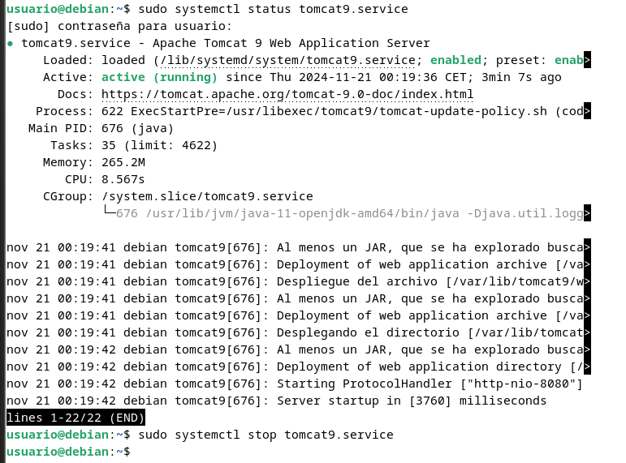

## Instalación de Node.js, Express y test de la primera aplicación

La primera parte de la práctica es muy sencilla. Consistirá en instalar sobre nuestra Debian 11 tanto Node.js como Express y tras ello crear un archivo `.js` de prueba para comprobar que nuestro primer despliegue funciona correctamente.

Para ello, os podéis apoyar [en este sencillo tutorial](https://web.archive.org/web/20240420163631/https://unixcop.com/how-to-install-expressjs-on-debian-11/) o [este otro](https://www.server-world.info/en/note?os=Debian_12&p=nodejs&f=1), y para Express:

Basándome en el primer tutorial, la instalación sería tal que así:

#### Instalación NodeJS

1. Actualizar el sistema con los comandos `sudo apt update` y `sudo apt upgrade`

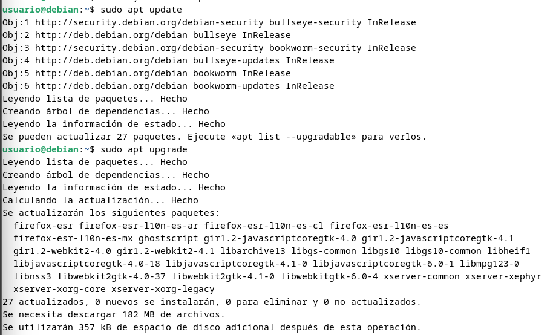

2. Agregar el repositorio de Node.js con el comando `curl -sL https://deb.nodesource.com/setup_16.x | sudo -E bash -`

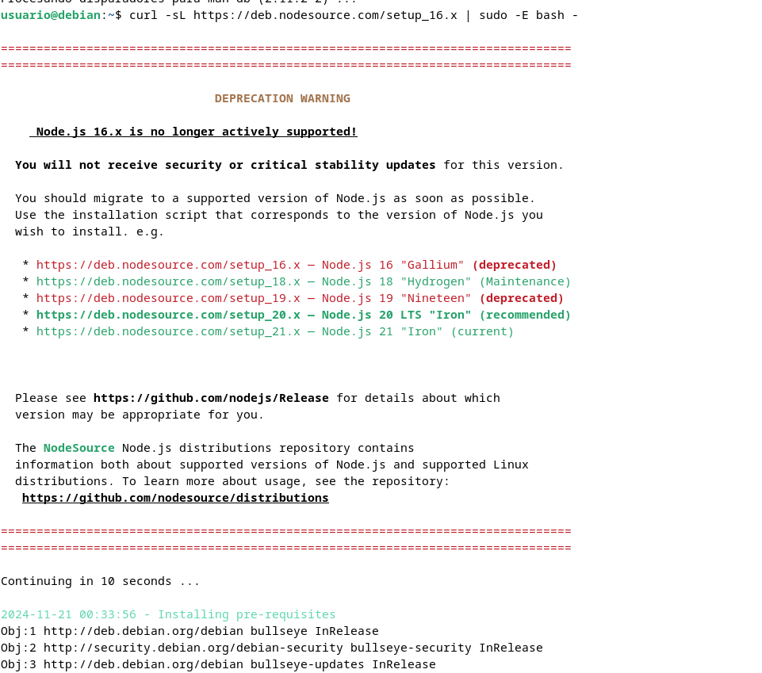

3. Instalamos Node.js `sudo apt install nodejs` y para verificar la instalación hacemos `node --version` y `npm --version` que nos tendrán que dar como resultado v16.20.2 y 8.19.4 respectivamente o mejor.

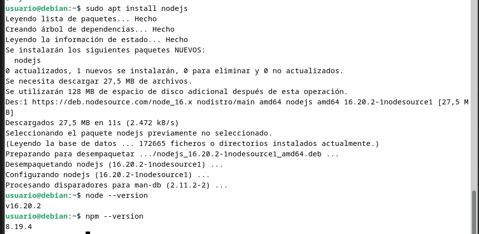

#### Instalación ExpressJS

1. Primero instalamos Express.js de forma global con el comando `sudo npm install -g express`

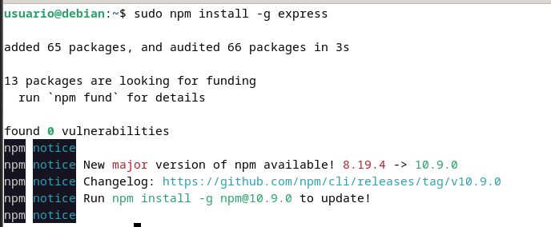

2. Creamos una carpeta para el proyecto con los comandos `mkdir proyecto` y `cd proyecto` para ubicarnos en el

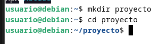

3. Inicializamos el proyecto con el comando `npm init -y`

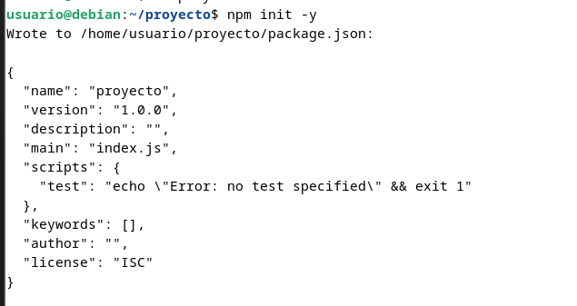

4. Procedemos a instalar Express.js de forma local con `npm install express`

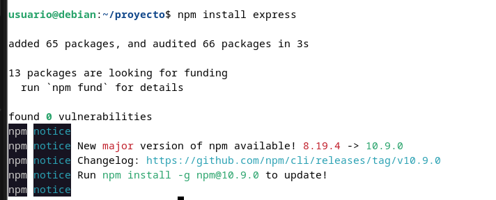

#### Crear una aplicación con Express.js

1. Crear un archivo para la aplicación  con el comando `sudo nano app.js` 

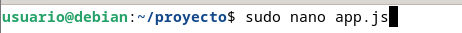

1. Le añadimos el siguiente código

```js
const express = require('express')
const app = express()
const port = 3000

app.get('/', (req, res) => {
    res.send('Hello. Welcome to this blog')
})

app.listen(port, () => {
    console.log(`Example app listening at http://localhost:${port}`)
})
``` 

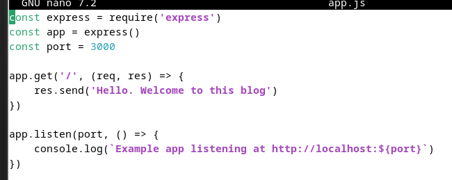

3. Ejecutamos la aplicación con el comando `node app.js`

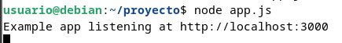

4. Si abrimos un navegador y visitamos http://vuestra-IP:3000 podremos ver la siguiente ventana

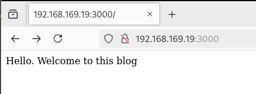

En lugar de acceder a `http://localhost:3000`, debéis acceder desde vuestra máquina local a `http://IP-maq-virtual:3000`, utilizando la IP concreta de vuestra máquina virtual.

!!! warning "Recordatorio"

    Debéis añadir a vuestro grupo de seguridad el puerto que estéis utilizando para acceder a la aplicación (3000 u otro), permitiendo el tráfico de entrada hacia ese puerto TCP.

Recordad parar el servidor (CTRL+C) al acabar la práctica.

!!! infor "Task"

    Documenta, incluyendo capturas de pantallas, el proceso que has seguido para realizar el despliegue de esta nueva aplicación, así como el resultado final.

## Despliegue de una nueva aplicación

Vamos ahora a realizar el despliegue de una aplicación de terceros para ver cómo es el proceso.

Se trata de un "prototipo" de una aplicación de predicción meteorológica que podéis encontrar en este [repositorio de Github](https://github.com/alexkowsik/react-weather-app).

Tal y como indican las instrucciones del propio repositorio, los pasos a seguir son, en primer lugar, clonar el repositorio a nuesta máquina:

`git clone https://github.com/MehedilslamRipon/Shopping-Cart-Application`

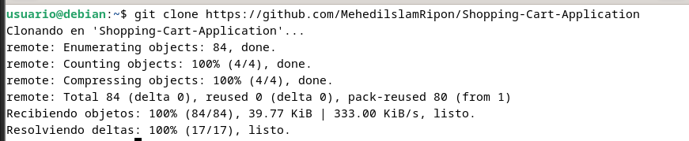

Movernos al nuevo directorio:

`cd Shopping-Cart-Application/`

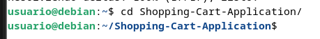

Instalar las librerías necesarias (paciencia, este proceso puede tardar un buen rato):

`npm install`

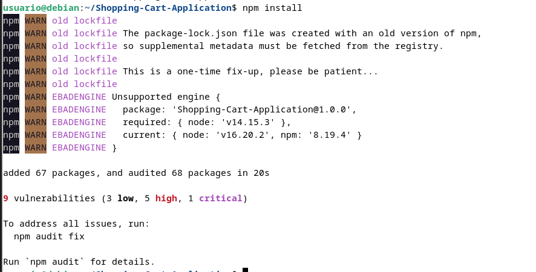

Y, por último, iniciar la aplicación:

`npm run start`

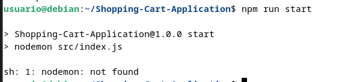

Cuando sigáis el proceso necesario e intentéis iniciar la aplicación con Express, os dará un error del tipo:

`sh: 1: nodemon: not found`

!!! infor "Tarea"

    Buscad cómo solucionar este problema y, tras ello, iniciad la aplicación sin problemas.

    ¿Qué comando habéis usado para solucionar el fallo anterior?¿Cuál es su cometido?¿Qué archivo se ha modificado al ejecutarlo? Documéntalo todo en el informe de la práctica.

El error indica que el script requiere nodemon que se instala cuando lo instalamos de forma global primero. Para arreglarlo debemos:

1. Instalar nodemon global con el comando `sudo npm install -g nodemon`

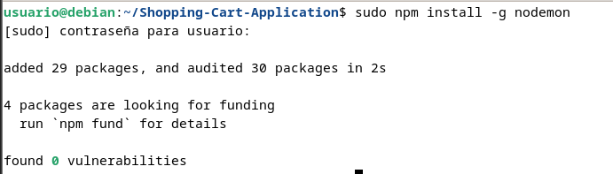

2. Una vez instalamos, verificamos que se ha instalado correctamente comprovando la versión instalada

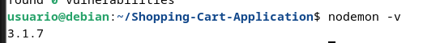

3. Una vez hecho esto, si volvemos a ejecutar el comando `npm run start` 

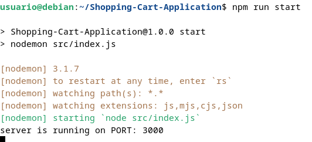

4. Si todo está correcto se mostrará el siguiente mensaje en http://vuestra-ip:3000
   
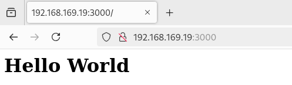

Todo esto se pudo hacer ya que al instalar nodemon como dependencia, el archivo `package.json` se modificó en la sección `"dependencies"` añadiendo distintas dependencias necesarias para que la aplicación funcione. 
- `cors` --> Lo que hace es manejar las políticas de recursos compratidos entre orígenes, facilitando que un servidor permita solicitudes desde diferentes dominios.
- `ejs` --> Motor de plantillas para renderizar visitas HTML dinámicas
- `express` --> Es un framework minimalista de Node.js para manejar rutas, solicitudes, respuestas...

```json
"dependencies": {
   "cors": "^2.8.5",
   "ejs": "^3.1.5",
   "express": "^4.17.1"
}
```

!!! infor "Tarea"

    Documenta, incluyendo capturas de pantallas, el proceso que has seguido para realizar el despliegue de esta nueva aplicación, así como el resultado final.

## Cuestiones

Cuando ejecutáis el comando `npm run start`, lo que estáis haciendo es ejecutar un script:

* ¿Donde podemos ver que script se está ejecutando?

Podemos ver el script que se ejecuta dentro del archivo `package.json` en la sección `"scripts"`.

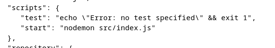

* ¿Qué comando está ejecutando?

En el script `start` del apartado `"scripts"` se ejecuta el comando `nodemon src/index.js` que lo que hace es iniciar el archvio principal de la aplicación y utiliza nodemon para reiniciar automáticamente el servidor cuando detecta cambios en archivos del proyecto.

Como ayuda, podéis consultar [esta información](https://www.freecodecamp.org/espanol/news/node-js-npm-tutorial/).

## Referencias

[How to install ExpressJS on Debian 11?](https://unixcop.com/how-to-install-expressjs-on-debian-11/)